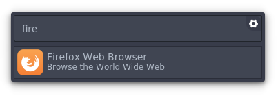

These themes are for [Albert](https://github.com/ManuelSchneid3r/albert), an Omnilauncher for linux.

# Smaller Arc Dark Grey


Based on the Arc Dark Grey 

# Installation
* Download [ZIP](https://github.com/diesphink/albert-themes/archive/master.zip)
* Copy .qss file to ```.local/share/albert/org.albert.frontend.boxmodel.widgets/themes/```
* Launch Albert & Change Theme to new theme
